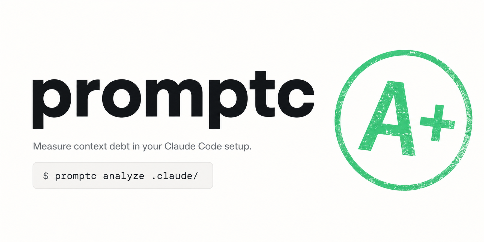

<p align="center">
  
</p>

# promptc

> Measure worst-case skill-context exposure in your Claude Code setup.

**Status:** v0.1.0 in development. Not yet published to PyPI; install from source.

## What this is for

If you've been collecting Claude Code skills for a while, your `.claude/`
has probably grown faster than your attention to it. The same security
rule lives in three different SKILL.md files. A skill description has
gone stale and Claude is loading the whole 5,000-token body just to
figure out it doesn't apply. There's no quick way to see this.

`promptc analyze` is a local-only audit: it walks your `.claude/`,
catches duplicated paragraphs across skills, computes a worst-case
"if Claude loads the body instead of just the description" multiplier,
and gives you a Grade — A through F — so you can tell at a glance
whether your setup is clean or has accumulated context debt.

All analysis runs locally. No data leaves your machine. No API keys
required.

## Install

```bash
git clone https://github.com/edenfunf/promptc
cd promptc
pip install -e .
```

(PyPI release lands with v0.1.1.)

## Usage

```bash
promptc analyze .          # scans ./.claude/ if present, else .
promptc analyze .claude/
promptc analyze . --no-html --format json
```

Run `promptc analyze --help` for all flags (`--threshold`, `--min-words`,
`--exclude`, `--format`, `--open`, …).

## Sample output

Running on the included demo fixture:

```
$ promptc analyze examples/bloated-demo

+------------------------------------------------------------------------+
|                                                                        |
|                                D+                                      |
|                                                                        |
|             461 tokens of duplicate content across 5 files             |
|                     (32% of 1,446 scanned tokens)                      |
|                                                                        |
|             Plus 23.7x worst-case context exposure on top.             |
|                                                                        |
|                         Top offenders below.                           |
|                                                                        |
+------------------------------------------------------------------------+

File                          Role   Total  Body  Desc  Dup  Dup%
skills/code-review/SKILL.md   skill    286   270     8   38   14%
skills/python-style/SKILL.md  skill    290   272    10  129   47%
skills/security/SKILL.md      skill    314   291    16   99   34%
skills/sql-safety/SKILL.md    skill    284   266     9  134   50%
skills/testing/SKILL.md       skill    272   251    14   61   24%

Top duplicate groups:
  1. 244 tokens wasted (5 chunks, exact): all 5 SKILL.md files share
     an identical "Boundary discipline" paragraph
  2. 152 tokens wasted (5 chunks, near): an SQL-injection-prevention
     rule has been pasted across all 5 skills with minor wording tweaks
  ...

Full report: ./promptc-report.html
```

The HTML report adds a hero panel, a per-skill exposure breakdown,
a side-by-side duplicate-rule view, and a methodology section that
explains every formula.

## What promptc does NOT do

- **Cursor `.cursor/rules/*.mdc`**: not yet scanned. If `.cursor/` is
  detected next to `.claude/`, the CLI prints a warning so the gap is
  explicit. Tracked for v0.2.
- **Token-cost dollars**: report speaks tokens; conversion to a $ figure
  for a specific Claude pricing tier is a v0.2 nice-to-have.
- **Auto-fix**: promptc diagnoses, you decide. There is no
  `promptc apply` that rewrites your skills.
- **Telemetry / phone-home**: nothing. Local files in, local report
  out.

## Glossary

- **SKILL.md** — the entrypoint file for a Claude Code skill. Lives at
  `.claude/skills/<name>/SKILL.md`. Only this file gets the `skill`
  role; supporting files (templates, references, examples) under the
  same directory are scanned as `other`.
- **Duplicate-content ratio** (a.k.a. *bloat ratio*) — share of total
  scanned tokens that promptc flagged as a near-duplicate of content
  elsewhere. Includes duplicates from supporting docs, not just SKILL.md
  bodies. Drives the Grade.
- **Promised load** — tokens for a SKILL.md's `description` frontmatter
  value. This is what Claude Code's docs say loads at session start.
- **Worst-case load** — tokens for a SKILL.md's body. The upper bound
  cost if the body ends up in context instead of just the description.
- **Exposure multiplier** — `body_tokens / description_tokens`. Both
  sides are content-only; frontmatter overhead is excluded from both.
- **Insufficient state** — promptc shows "Not enough to audit yet" when
  there are fewer than 3 SKILL.md files OR fewer than 1,000 aggregate
  body tokens across skills. Avoids misleading A+ grades on tiny setups.

The HTML report has a "How this is graded" section with the full
formulae and threshold table.

## Roadmap

- **v0.1.x** — `--output PATH` flag; cross-language SDK path detector
  (down-weights duplicate clusters whose paths only differ in
  `/python/`, `/go/`, etc); broader tokenizer calibration across CJK
  and pure-code corpora (initial English mixed prose/code sample shows
  cl100k_base underestimates Claude tokens by ~18%).
- **v0.2** — `.cursor/rules/*.mdc` scanning; methodology calibration
  (replace heuristic A/B/C/D/F thresholds with a reference distribution
  derived from real `.claude/` directories); `--watch`; share affordance
  for the HTML report.
- **v0.3+** — semantic dedup (embedding-based, not just Jaccard);
  cross-binding language detector; `$` cost conversion.

## Development

```bash
pip install -e ".[dev]"
pytest
ruff check .
```

## Demo

A walkthrough of the HTML report `promptc` generates for a real
`.claude/` directory (anthropics/skills, Grade A+).

<video src="https://github.com/user-attachments/assets/9a84dfc2-7246-4bed-bf24-a081bfc2c8c9" controls width="100%">
  Your browser does not support inline video.
  <a href="https://github.com/user-attachments/assets/9a84dfc2-7246-4bed-bf24-a081bfc2c8c9">Open the demo video</a>.
</video>

## License

MIT
